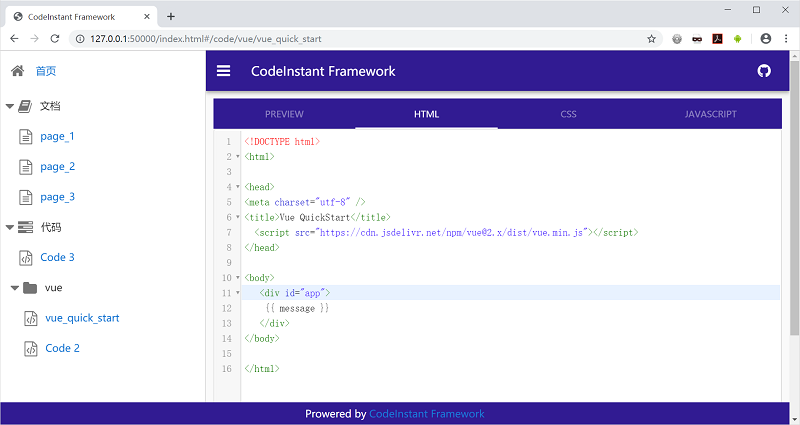

CodeInstant
===================================

CodeInstant是一款前端代码快速搭建静态展示网站工具。

## 文件结构

    |- build                    脚本文件夹
    |--- build.js
    |- data                     数据文件夹
    |--- codes                  代码数据文件夹
    |----- codes_3
    |------- index.html
    |----- vue
    |------- vue_quick_strat    
    |--------- index.html
    |--------- main.js
    |--------- style.css
    |------- vue_route
    |--------- index.html
    |------ code.config.json    
    |--- home
    |----- index.md
    |--- pages                  文档数据文件夹                 
    |----- page_1
    |------- index.md
    |----- page_2
    |------- index.md
    |----- page_3
    |------- index.md
    |------ page.config.json
    |--- app.config.json
    |- framwrok                 框架文件夹
    |-index.html                网站首页

## GitHub免费搭建个人博客或网站

------------------------------------------------

**关注微信公众号，获取软件最新消息**

